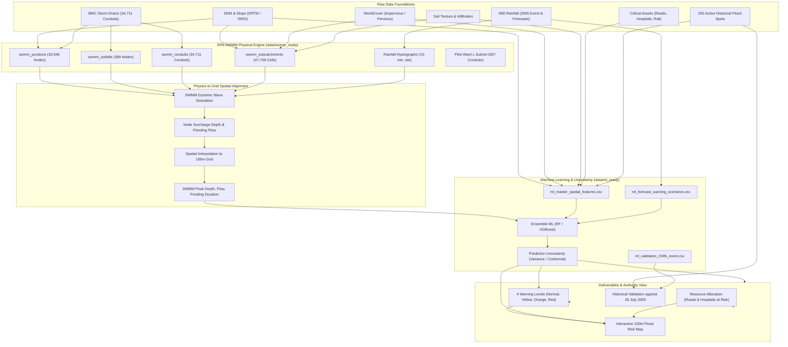

# Mumbai Urban Stormwater Flood Prediction System
## Comprehensive Dataset Package & End-to-End Implementation Roadmap

---

### Executive Summary

To solve the official problem statement:
> **"Urban Stormwater Flood Prediction System: Predict which city areas may flood in heavy rain and give early warnings in levels with uncertainty, validated against a real past flood for a sample city area."**

We have prepared and verified two complete dataset packages:
1. **`data/swmm_ready/`**: Exact relational tables (Junctions, Outfalls, Conduits, Subcatchments, and 15-minute Rainfall Hyetographs) needed to generate EPA-SWMM `.inp` models—both **Citywide** (34,711 conduits) and for the dedicated **Pilot Sample Area (Ward L - Kurla/Kalina/Mithi)**.
2. **`data/ml_ready/`**: 47,758 cells with 31 spatial, hydrological, soil, drainage stress, and infrastructure exposure features, plus a 238,790-row multi-scenario forecast matrix across 5 early warning alert tiers, and a dedicated 26 July 2005 real past flood validation dataset.

---

## 1. System Architecture



---

## 2. Directory Structure & File Inventory

```text
data/
├── swmm_ready/
│   ├── swmm_conduits_citywide.csv       (34,711 conduits; standard SWMM shapes, dimensions, Manning's n, slopes)
│   ├── swmm_junctions_citywide.csv      (33,946 junctions; UTM43 & WGS84 coords, THD & MSL inverts, DEM rim)
│   ├── swmm_outfalls_citywide.csv       (399 outfalls; tidal boundary flags, coastal coordinates)
│   ├── swmm_subcatchments_citywide.csv  (47,758 subcatchments; area, % imperv, slope, Horton infiltration)
│   ├── timeseries_2005_july26.dat       (SWMM 15-min hyetograph for 944.2mm disaster)
│   ├── timeseries_design_storms.dat     (15-min design storms: 25, 50, 100, 150 mm/hr)
│   ├── swmm_rainfall_catalog.csv        (Event summaries, intensities, durations)
│   └── pilot_ward_L/
│       ├── swmm_conduits_ward_L.csv     (927 conduits in Kurla/Kalina/Mithi basin)
│       ├── swmm_junctions_ward_L.csv    (1,085 junctions)
│       ├── swmm_outfalls_ward_L.csv     (37 outfalls)
│       └── swmm_subcatchments_ward_L.csv(1,516 subcatchments)
│
└── ml_ready/
    ├── ml_master_spatial_features.csv    (47,758 cells × 31 features: DEM, TWI, drains, exposure, soil)
    ├── ml_forecast_warning_scenarios.csv (238,790 rows: 5 alert tiers × 47,758 cells with SCS runoff)
    ├── ml_validation_2005_event.csv      (47,758 cells forced by 2005 storm against 333 historical flood spots)
    ├── ml_pilot_ward_L.csv               (1,516 cells for the pilot sample area)
    └── dataset_metadata.json             (Metadata manifest, warning thresholds, spatial folds)
```

---

## 3. Data Dictionary

### A. SWMM Tables (`data/swmm_ready/`)
| File | Key Columns | Description |
|---|---|---|
| `swmm_conduits_citywide.csv` | `conduit_id`, `us_node_id`, `ds_node_id`, `length_m`, `manning_n`, `shape`, `geom1_height_m`, `geom2_width_m`, `slope_m_per_m`, `full_capacity_m3s` | Cross-sections mapped to standard SWMM keywords (`CIRCULAR`, `RECT_CLOSED`, `RECT_OPEN`, `ARCH`). Manning's $n$ assigned by material (0.013–0.025). |
| `swmm_junctions_citywide.csv`| `junction_id`, `x_utm43`, `y_utm43`, `lon`, `lat`, `invert_elev_thd_m`, `invert_elev_msl_m`, `ground_elev_thd_m`, `max_depth_m`, `ponded_area_m2` | Town Hall Datum (THD) and Mean Sea Level (MSL) reconciled. DEM rim sampled. Ponded area set for surface street ponding. |
| `swmm_outfalls_citywide.csv` | `outfall_id`, `x_utm43`, `y_utm43`, `invert_elev_thd_m`, `outfall_type`, `tide_curve_name`, `gated` | Terminal discharge nodes into Arabian Sea, Mahim Creek, Mithi River. |
| `swmm_subcatchments_citywide.csv`| `subcatchment_id`, `outlet_node_id`, `area_ha`, `pct_imperv`, `width_m`, `pct_slope`, `horton_max_rate_mmhr`, `horton_min_rate_mmhr` | 100m grid cells mapped to nearest drainage junction via KDTree. Horton parameters assigned from soil texture. |

### B. Machine Learning Tables (`data/ml_ready/`)
| File | Key Columns | Description |
|---|---|---|
| `ml_master_spatial_features.csv` | `elevation_mean`, `slope_mean`, `topographic_wetness_index`, `drain_density`, `distance_to_drain`, `drainage_stress_index`, `built_up_fraction`, `building_count`, `road_length_m`, `has_hospital`, `has_railway`, `spatial_cv_fold`, `flood_label` | Spatial predictors, indices, critical infrastructure exposure, 5 spatial block cross-validation folds, and 333 historical flood labels. |
| `ml_forecast_warning_scenarios.csv` | `scenario_name`, `warning_tier`, `warning_level_code`, `rainfall_1h_mm`, `rainfall_3h_mm`, `rainfall_24h_mm`, `tide_factor`, `scs_curve_number`, `scs_runoff_3h_mm` | 5 operational alert scenarios (Normal, Yellow, Orange, Red, Extreme) expanded across all 47,758 cells. |
| `ml_validation_2005_event.csv` | All spatial features + 26 July 2005 rainfall forcing (`P_24h = 944.2mm`, `P_3h = 431.7mm`, `Tide = 1.0`) | Ground truth event table for validating model predictions against the real historical disaster. |

---

## 4. End-to-End Implementation Roadmap

### Step 1: Run Pilot SWMM Simulation on Ward L
- **Action**: Write a simple script `scripts/build_swmm_inp.py` that reads `data/swmm_ready/pilot_ward_L/` and formats an EPA-SWMM `.inp` text file.
- **Why Ward L first?**: Ward L (Kurla) contains 927 conduits and 1,085 junctions. It runs in under 10 seconds in SWMM, allowing rapid debugging before running citywide.
- **Input**: `swmm_conduits_ward_L.csv`, `swmm_junctions_ward_L.csv`, `swmm_outfalls_ward_L.csv`, `timeseries_2005_july26.dat`.
- **Output**: `ward_L_simulation.rpt` containing peak node water depths, surcharge hours, and overflow volumes.

### Step 2: Spatial SWMM-to-Grid Alignment
- **Action**: Parse `ward_L_simulation.rpt` / binary `.out` file to extract:
  - `peak_depth_m` at each junction
  - `flooding_volume_m3` at surcharging nodes
  - `capacity_utilization` in conduits
- **Interpolation**: Map junction peak depths to the 100m grid cells using Inverse Distance Weighting (IDW) or nearest drainage junction mapping.

### Step 3: Train Physics-Informed ML Model
- **Action**: Train a classifier and regressor on `ml_forecast_warning_scenarios.csv` (or fused with SWMM features):
  - Model A (Baseline): Spatial Random Forest / Gradient Boosting (XGBoost/LightGBM).
  - Validation: 5-Fold Spatial Block CV (`spatial_cv_fold` column) so test folds are entire unseen administrative wards (strictly avoiding spatial leakage).
  - Target 1: Flood Susceptibility / Occurrence Probability ($P(\text{Flood}) \in [0, 1]$).
  - Target 2: Predicted Ponding Depth (meters).

### Step 4: Quantify Prediction Uncertainty
- **Method**: Use ensemble variance across the tree estimators:
  $$\sigma^2(x) = \frac{1}{B} \sum_{b=1}^B (f_b(x) - \bar{f}(x))^2$$
  Or Conformal Prediction intervals $[y_{\text{lower}}, y_{\text{upper}}]$ at a 90% confidence level.
- **Output**: Every prediction displays `Predicted Risk: High (82%) ± 9% Uncertainty`.

### Step 5: Assign Warning Levels & Validate Against Real Past Flood
- **Warning Level Thresholds**:
  - **Level 0 (Green / Normal)**: $P < 0.20$ | Depth $< 0.05\text{ m}$ (Safe)
  - **Level 1 (Yellow / Advisory)**: $0.20 \le P < 0.50$ | Depth $0.05 - 0.20\text{ m}$ (Minor waterlogging)
  - **Level 2 (Orange / Watch)**: $0.50 \le P < 0.75$ | Depth $0.20 - 0.50\text{ m}$ (Road traffic disrupted)
  - **Level 3 (Red / Warning)**: $P \ge 0.75$ | Depth $> 0.50\text{ m}$ (Severe flooding, life safety risk)
- **Validation**: Evaluate on `ml_validation_2005_event.csv` against BMC historical flood spots:
  - Calculate Precision, Recall, F1-Score, and ROC-AUC.
  - Document false positives/negatives and physical limitations.

### Step 6: Alert Dashboard for City Authorities
- **UI Components**:
  - Map viewer with 100m risk polygons colored by warning level (Green, Yellow, Orange, Red).
  - Rainfall forecast slider (e.g., 25 mm/h $\to$ 100 mm/h) showing dynamic risk expansion.
  - Resource planning view: automatically lists affected roads (`road_length_m`), inundated buildings (`building_count`), and exposed hospitals (`has_hospital = 1`) to direct dewatering pumps and emergency teams.
