# Mumbai Urban Stormwater Flood Prediction System
# 📘 Complete Team Implementation Blueprint & Engineering Guide

> **Purpose:** This document is the step-by-step engineering blueprint for your development team. Any colleague reading this guide can follow the code, mathematical formulas, file paths, and CLI commands to build the complete hybrid SWMM + ML early warning system from scratch.

---

## 📑 Table of Contents
1. [System Architecture & Team Workflow](#1-system-architecture--team-workflow)
2. [Environment Setup & File Hierarchy](#2-environment-setup--file-hierarchy)
3. [Phase 1: Building the EPA-SWMM Model](#3-phase-1-building-the-epa-swmm-model)
4. [Phase 2: Extracting Physics & Spatial Grid Alignment](#4-phase-2-extracting-physics--spatial-grid-alignment)
5. [Phase 3: Machine Learning Model Training (Spatial CV)](#5-phase-3-machine-learning-model-training-spatial-cv)
6. [Phase 4: Uncertainty Quantification & Early Warning Tiers](#6-phase-4-uncertainty-quantification--early-warning-tiers)
7. [Phase 5: Historical 2005 Event Validation](#7-phase-5-historical-2005-event-validation)
8. [Phase 6: Authority Alert View & Dashboard](#8-phase-6-authority-alert-view--dashboard)
9. [Team Roles & Task Division](#9-team-roles--task-division)

---

## 1. System Architecture & Team Workflow

```mermaid
flowchart LR
    subgraph S1["Phase 1: Physics Engine"]
        A1["data/swmm_ready/"] --> A2["build_swmm_inp.py"]
        A2 --> A3["ward_L_kurla.inp"]
        A3 --> A4["EPA-SWMM Engine"]
        A4 --> A5["Simulation Report (.rpt)"]
    end

    subgraph S2["Phase 2: Hybrid Bridge"]
        A5 --> B1["parse_swmm_results.py"]
        B1 --> B2["Map to 100m Grid Cells"]
        B2 --> B3["Physics Features (onset_intensity, depth)"]
    end

    subgraph S3["Phase 3 & 4: ML & Uncertainty"]
        B3 --> C1["ml_master_spatial_features.csv"]
        C1 --> C2["train_flood_ml.py"]
        C2 --> C3["Spatial 5-Fold CV (Ward Groups)"]
        C3 --> C4["P(Flood) + Uncertainty σ(x)"]
        C4 --> C5["4 Warning Tiers (Green, Yellow, Orange, Red)"]
    end

    subgraph S4["Phase 5 & 6: Delivery"]
        C5 --> D1["Validation Report (2005 Storm)"]
        C5 --> D2["Authority Map Dashboard"]
        D2 --> D3["Exposed Roads & Hospitals List"]
    end
```



---

## 2. Environment Setup & File Hierarchy

### A. Python Environment
Install the required packages in Python 3.10+:
```bash
pip install numpy pandas geopandas shapely scipy scikit-learn rasterio matplotlib streamlit folium
```

### B. Pre-Built Data Files (Already Generated & Ready in Workspace)
Your colleagues do not need to re-download or clean raw GIS data. Use these ready-made packages:

```text
mumbai_flood_data_ready_package/
├── data/
│   ├── swmm_ready/
│   │   ├── swmm_conduits_citywide.csv       <- 34,711 Conduits (Shapes, Dimensions, Roughness)
│   │   ├── swmm_junctions_citywide.csv      <- 33,946 Junctions (Coordinates, Inverts, DEM Rim)
│   │   ├── swmm_outfalls_citywide.csv       <- 399 Outfalls (Tidal boundaries, Sea outlets)
│   │   ├── swmm_subcatchments_citywide.csv  <- 47,758 Subcatchments (Impervious %, Slope, Horton)
│   │   ├── timeseries_2005_july26.dat       <- 15-min hyetograph of 944.2mm disaster
│   │   ├── timeseries_design_storms.dat     <- Design storms (25, 50, 100, 150 mm/h)
│   │   └── pilot_ward_L/                    <- Subnet for Ward L (Kurla/Kalina/Mithi Basin)
│   │       ├── swmm_conduits_ward_L.csv     (927 conduits)
│   │       ├── swmm_junctions_ward_L.csv    (1,085 junctions)
│   │       ├── swmm_outfalls_ward_L.csv     (37 outfalls)
│   │       └── swmm_subcatchments_ward_L.csv(1,516 subcatchments)
│   │
│   └── ml_ready/
│       ├── ml_master_spatial_features.csv    <- 47,758 cells × 31 features (DEM, TWI, Drains, Exposure)
│       ├── ml_forecast_warning_scenarios.csv <- 238,790 rows across 5 warning scenarios & tide
│       ├── ml_validation_2005_event.csv      <- Ground-truth 2005 event dataset
│       ├── ml_pilot_ward_L.csv               <- Sample pilot city area dataset
│       └── dataset_metadata.json             <- Data dictionary & fold definitions
```

---

## 3. Phase 1: Building the EPA-SWMM Model

### Goal:
Write `scripts/build_swmm_inp.py` to assemble the CSV tables from `data/swmm_ready/pilot_ward_L/` into a valid `.inp` file.

### Required SWMM Sections:
1. `[OPTIONS]`: Flow units = `LPS` or `CMS`, Infiltration = `HORTON`, Routing = `DYNWAVE`, Ponding = `ALLOW`.
2. `[JUNCTIONS]`: Node ID, Invert Elev (THD), Max Depth, Init Depth, Sur Depth, Apond ($100\text{ m}^2$).
3. `[OUTFALLS]`: Node ID, Invert Elev (THD), Type (`FREE`), Gated (`NO`).
4. `[CONDUITS]`: Conduit ID, From Node, To Node, Length, Manning $n$, InOffset (0), OutOffset (0).
5. `[XSECTIONS]`: Conduit ID, Shape (`RECT_CLOSED`, `RECT_OPEN`, `CIRCULAR`, `ARCH`), Geom1 (Height), Geom2 (Width), Barrels (1).
6. `[SUBCATCHMENTS]`: Subcatchment ID, Raingage (`RG_MUMBAI`), Outlet Node ID, Area (ha), % Imperv, Width ($100\text{ m}$), % Slope.
7. `[SUBAREAS]`: N-Imperv ($0.015$), N-Perv ($0.20$), S-Imperv ($2.0\text{ mm}$), S-Perv ($5.0\text{ mm}$), % Zero-Imperv ($25\%$), RouteTo (`OUTLET`).
8. `[INFILTRATION]`: Subcatchment ID, MaxRate ($50-70\text{ mm/h}$), MinRate ($5-10\text{ mm/h}$), Decay ($3.0$), DryTime ($7$).
9. `[RAINGAGES]`: Name = `RG_MUMBAI`, Format = `VOLUME`, Interval = `0:15`, Source = `TIMESERIES TS_2005_JULY26`.
10. `[TIMESERIES]`: Append the contents of `timeseries_2005_july26.dat` or `timeseries_design_storms.dat`.
11. `[COORDINATES]`: Node ID, X-Coord (UTM43), Y-Coord (UTM43).

### Reference Script (`scripts/build_swmm_inp.py`):
```python
import pandas as pd
from pathlib import Path

DIR = Path("data/swmm_ready/pilot_ward_L")
OUT_FILE = Path("models/ward_L_kurla.inp")
OUT_FILE.parent.mkdir(parents=True, exist_ok=True)

df_junc = pd.read_csv(DIR / "swmm_junctions_ward_L.csv")
df_out = pd.read_csv(DIR / "swmm_outfalls_ward_L.csv")
df_cond = pd.read_csv(DIR / "swmm_conduits_ward_L.csv")
df_sc = pd.read_csv(DIR / "swmm_subcatchments_ward_L.csv")
ts_text = (DIR.parent / "timeseries_2005_july26.dat").read_text()

with open(OUT_FILE, "w") as f:
    f.write("[TITLE]\nWard L Kurla Stormwater Simulation\n\n")
    f.write("[OPTIONS]\nFLOW_UNITS CMS\nINFILTRATION HORTON\nFLOW_ROUTING DYNWAVE\nALLOW_PONDING YES\nSTART_DATE 07/26/2005\nSTART_TIME 00:00:00\nEND_DATE 07/27/2005\nEND_TIME 06:00:00\nROUTING_STEP 15\n\n")
    
    # Raingages
    f.write("[RAINGAGES]\nRG_MUMBAI VOLUME 0:15 1.0 TIMESERIES TS_2005_JULY26\n\n")
    
    # Junctions
    f.write("[JUNCTIONS]\n;;Name Invert MaxDepth InitDepth SurDepth Apond\n")
    for _, r in df_junc.iterrows():
        f.write(f"{r['junction_id']} {r['invert_elev_thd_m']} {r['max_depth_m']} 0 0 {r['ponded_area_m2']}\n")
    f.write("\n")
    
    # Outfalls
    f.write("[OUTFALLS]\n;;Name Invert Type StageData Gated\n")
    for _, r in df_out.iterrows():
        f.write(f"{r['outfall_id']} {r['invert_elev_thd_m']} FREE NO\n")
    f.write("\n")
    
    # Conduits
    f.write("[CONDUITS]\n;;Name FromNode ToNode Length Roughness InOffset OutOffset InitFlow MaxFlow\n")
    for _, r in df_cond.iterrows():
        f.write(f"{r['conduit_id']} {r['us_node_id']} {r['ds_node_id']} {r['length_m']} {r['manning_n']} 0 0 0 {r['full_capacity_m3s']}\n")
    f.write("\n")
    
    # Cross Sections
    f.write("[XSECTIONS]\n;;Conduit Shape Geom1 Geom2 Geom3 Geom4 Barrels\n")
    for _, r in df_cond.iterrows():
        f.write(f"{r['conduit_id']} {r['shape']} {r['geom1_height_m']} {r['geom2_width_m']} 0 0 1\n")
    f.write("\n")
    
    # Subcatchments
    f.write("[SUBCATCHMENTS]\n;;Name Raingage Outlet Area %Imperv Width %Slope Curb\n")
    for _, r in df_sc.iterrows():
        f.write(f"{r['subcatchment_id']} RG_MUMBAI {r['outlet_node_id']} {r['area_ha']} {r['pct_imperv']} {r['width_m']} {r['pct_slope']} 0\n")
    f.write("\n")
    
    # Subareas
    f.write("[SUBAREAS]\n;;Subcatch N-Imperv N-Perv S-Imperv S-Perv PctZero RouteTo\n")
    for _, r in df_sc.iterrows():
        f.write(f"{r['subcatchment_id']} 0.015 0.20 2.0 5.0 25.0 OUTLET\n")
    f.write("\n")
    
    # Infiltration
    f.write("[INFILTRATION]\n;;Subcatch MaxRate MinRate Decay DryTime MaxInfil\n")
    for _, r in df_sc.iterrows():
        f.write(f"{r['subcatchment_id']} {r['horton_max_rate_mmhr']} {r['horton_min_rate_mmhr']} 3.0 7.0 0\n")
    f.write("\n")
    
    # Timeseries
    f.write("[TIMESERIES]\n" + ts_text + "\n\n")
    
    # Coordinates
    f.write("[COORDINATES]\n;;Node X Y\n")
    for _, r in df_junc.iterrows():
        f.write(f"{r['junction_id']} {r['x_utm43']} {r['y_utm43']}\n")
    for _, r in df_out.iterrows():
        f.write(f"{r['outfall_id']} {r['x_utm43']} {r['y_utm43']}\n")
    f.write("\n[END]\n")

print("Generated:", OUT_FILE)
```

---

## 4. Phase 2: Extracting Physics & Spatial Grid Alignment

### Goal:
Run the simulation and extract:
1. **`peak_depth_m`**: Maximum water depth reached at each manhole junction.
2. **`hours_surcharged`**: Number of hours water backed up above conduit crown.
3. **`total_flooding_m3`**: Volume of surface overflow ponded on the street.
4. **`onset_intensity`**: The rainfall intensity (from the ladder: $15, 25, 50, 75, 100\text{ mm/h}$) where the node first floods.

### Spatial Aggregation to 100m Grid:
* Nodes $\to$ 100m Cell: Take `max(peak_depth_m)` and `sum(total_flooding_m3)` of all junctions located inside that grid cell.
* For cells without a node, inherit from their subcatchment's designated outlet node.

---

## 5. Phase 3: Machine Learning Model Training (Spatial CV)

### Goal:
Train Random Forest and XGBoost classifiers with strict **5-Fold Spatial Block Cross-Validation** to predict flood susceptibility without spatial data leakage.

### Training Strategy:
* **Feature Matrix**: [ml_master_spatial_features.csv](file:///c:/Users/aryan/Downloads/mumbai_flood_data_ready_package/data/ml_ready/ml_master_spatial_features.csv)
* **Key Features**:
  ```python
  FEATURES = [
      "elevation_mean", "slope_mean", "topographic_wetness_index",
      "built_up_fraction", "drain_density", "distance_to_drain",
      "drainage_stress_index", "distance_to_water", "building_count",
      "road_length_m", "scs_curve_number"
  ]
  ```
* **Target**: `historical_flood_label` (1 = documented flood hotspot, 0 = undocumented).
* **Cross-Validation Split**: Split on `spatial_cv_fold` column:
  * Fold 0: South Mumbai (Wards A, B, C, D, E)
  * Fold 1: South-Central (Wards F/N, F/S, G/N, G/S)
  * Fold 2: Eastern Suburbs South (Wards L, M/E, M/W)
  * Fold 3: Eastern Suburbs North (Wards N, S, T)
  * Fold 4: Western Suburbs (Wards H, K, P, R)

### Model Training Script:
```python
from sklearn.ensemble import RandomForestClassifier
from sklearn.metrics import average_precision_score, roc_auc_score
import pandas as pd
import numpy as np

df = pd.read_csv("data/ml_ready/ml_master_spatial_features.csv")
X = df[FEATURES].fillna(0.0)
y = df["flood_label"]
folds = df["spatial_cv_fold"]

cv_scores = []
for f in range(5):
    X_train, y_train = X[folds != f], y[folds != f]
    X_test, y_test = X[folds == f], y[folds == f]
    
    model = RandomForestClassifier(n_estimators=100, max_depth=10, class_weight="balanced", random_state=42)
    model.fit(X_train, y_train)
    
    probs = model.predict_proba(X_test)[:, 1]
    pr_auc = average_precision_score(y_test, probs)
    cv_scores.append(pr_auc)
    print(f"Fold {f} PR-AUC: {pr_auc:.3f}")

print(f"Mean Spatial PR-AUC: {np.mean(cv_scores):.3f}")
```

---

## 6. Phase 4: Uncertainty Quantification & Early Warning Tiers

### A. Quantifying Prediction Uncertainty $\sigma(x)$
Compute the standard deviation of predictions across individual decision tree estimators:
$$\sigma(x) = \sqrt{\frac{1}{B}\sum_{b=1}^B \left(p_b(x) - \bar{p}(x)\right)^2}$$

In Python:
```python
# tree_preds shape: (n_trees, n_samples)
tree_preds = np.array([tree.predict_proba(X_test.values)[:, 1] for tree in model.estimators_])
p_mean = np.mean(tree_preds, axis=0)        # Final Probability P(Flood)
p_uncertainty = np.std(tree_preds, axis=0)  # Prediction Uncertainty
```

### B. Categorizing into 4 Early Warning Levels

| Level Code | Alert Name | Probability Condition | Action for City Authorities |
|:---:|---|:---:|---|
| **0** | **Normal / Green** | $P < 0.20$ | Routine drainage monitoring |
| **1** | **Advisory / Yellow** | $0.20 \le P < 0.50$ | Clear road storm grates; alert ward control rooms |
| **2** | **Watch / Orange** | $0.50 \le P < 0.75$ | Pre-position portable dewatering pumps; caution low-lying roads |
| **3** | **Warning / Red** | $P \ge 0.75$ | Deploy emergency response teams; divert traffic from submerged underpasses |

---

## 7. Phase 5: Historical 2005 Event Validation

### Goal:
Validate the trained system against the **26 July 2005 extreme disaster event** using [ml_validation_2005_event.csv](file:///c:/Users/aryan/Downloads/mumbai_flood_data_ready_package/data/ml_ready/ml_validation_2005_event.csv).

### Validation Checklist:
1. Predict $P(\text{Flood})$ on the 47,758 cells forced by the 2005 storm ($944.2\text{ mm}$ rain, $1.0\text{ m}$ tide).
2. Calculate:
   * **Recall at Top-10% Risk**: Percentage of the 333 historical flood spots captured within the top 10% highest-risk cells.
   * **Precision-Recall AUC (PR-AUC)**.
   * **Confusion Matrix** at threshold $P = 0.50$.
3. Check pilot **Ward L (Kurla)**: Verify that chronic disaster spots (Bail Bazaar, Kalina, Mithi banks) are flagged as **Red Alert (Level 3)**.

---

## 8. Phase 6: Authority Alert View & Dashboard

### Dashboard Components (Streamlit / Web App):
1. **Interactive Map (100m Grid)**:
   * Cells colored by warning level: Green (#2ecc71), Yellow (#f1c40f), Orange (#e67e22), Red (#e74c3c).
   * Hover tooltip displaying: `Cell ID`, `Ward`, `Flood Probability (%)`, `Uncertainty (±%)`, `Elevation (m)`, `Drain Density (m/km²)`.
2. **Forecast Rainfall Slider**:
   * Slider from $0\text{ mm/h}$ to $150\text{ mm/h}$ dynamically updating the map risk.
3. **Resource & Asset Allocation Panel**:
   * Filter table showing **high-risk roads** (`road_length_m > 0` & `Risk = Red`).
   * Filter table showing **exposed critical facilities** (`has_hospital = 1` or `has_railway = 1`).
   * Summary card: *"Estimated dewatering pumps required: X units"*.

---

## 9. Team Roles & Task Division

| Role | Teammate | Key Responsibilities | Primary Files |
|---|---|---|---|
| **Hydrology & SWMM Lead** | Teammate 1 | Build `build_swmm_inp.py`, run pilot Ward L simulation in SWMM, extract node depth & flood volume outputs. | `swmm_ready/`, `build_swmm_inp.py` |
| **Machine Learning Lead** | Teammate 2 | Build `train_flood_ml.py`, implement 5-Fold Spatial CV, calibrate probabilities, compute tree uncertainty $\sigma(x)$. | `ml_ready/`, `train_flood_ml.py` |
| **GIS & Validation Lead** | Teammate 3 | Perform 2005 disaster validation, compute PR-AUC and Recall@Top-10%, map SWMM nodes to 100m grid. | `ml_validation_2005_event.csv` |
| **Frontend & UI Lead** | Teammate 4 | Build Streamlit/Folium dashboard, map visualization, forecast rainfall slider, authority asset impact view. | `app.py`, `dashboard/` |
